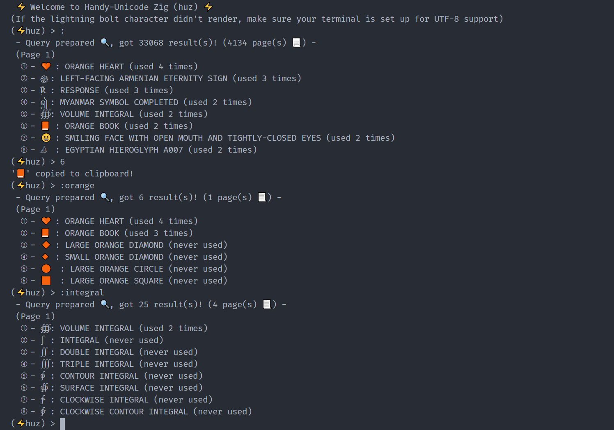

# handy-unicode

A command line tool for searching and copying unicode characters to the clipboard, made in zig.

### Usage

Your terminal must be set up for utf8 support!

- `:a search` : Search unicode characters using their description (and later user notes). Words are not necessarily in order. Words starting with - are excluded.
- `1` or any number 1-8 : Select and copy a character from the last query to clipboard.
- enter : Open next page of last query.
- `q` : Quit the program.

### Dependencies

Sqlite is needed (sqlite-zig is a submodule of this repos)

### TODO :

- [x] Basic searches
- [x] Searches with more than one keyword

Copy to clipboard :
- - [x] On windows
- - [ ] Any other platform
- [ ] User notes
- [ ] Auto db update
